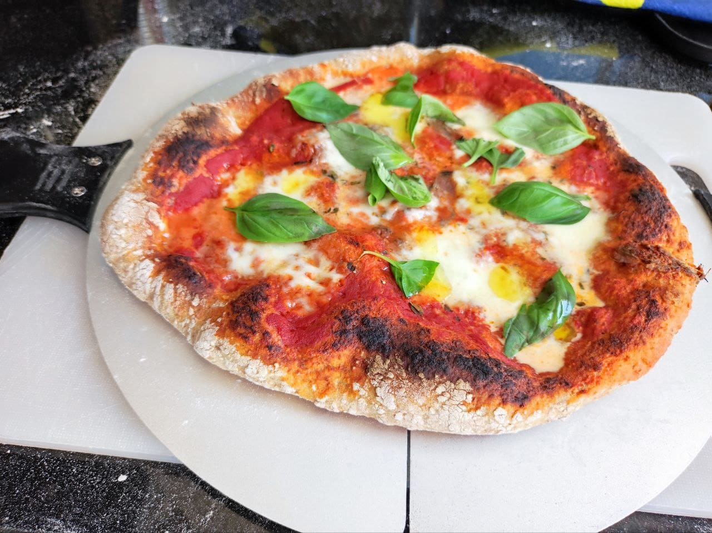

# Pizza ¿estilo napolitano?

Sirve 2 pizzas de unos 26-28cm

## Ingredientes para la masa

* Harina 250g
* Agua 160g
* Sal 7g
* Aceite de oliva 7g
* Levadura deshidratada 7g

## Ingredientes para la pizza

* Mozzarella fresca
* Passata (tomate triturado, no frito)
* Oregano
* Ajo
* Anchoas
* Albahaca fresca

## Instrucciones masa

1. Juntar en un bol 100g de agua tibia y la levadura.
2. Añadir 100g de harina y mezclar hasta que quede una pasta uniforme.
3. Dejarlo reposar unos 30 minutos hasta que aparezcan burbujas.
4. Añadir los ingredientes de la masa que quedan y amasar hasta que quede uniforme.
5. Dejarlo reposar 30 minutos.
6. Amasar como hacen [aquí][1]
7. Una vez hecho lo anterior ya se podría meter en la nevera. Lo mejor es
   preparar la pizza uno o dos días después.

## Preparar la pizza

1. Se deja reposar la masa en una superficie con harina para que se caliente y crezca.
   Véase de nuevo el [video][1].
2. Mezclar la passata, orégano al gusto y el ajo bien picado.
3. Aplanar la pizza.
4. Calentar el horno a la máxima temperatura 400ºC, si no esto sabe a mierda.
5. Añadir una capa de la salsa de tomate a la pizza y las anchoas.
6. Pone la pizza en el horno 2.5 minutos. 
7. Sacar y añadir la mozzarella y un chorrito de aceite de oliva.
8. Meter en el horno otros 2.5 minutos o hasta que empiece a tener parches negros.
9. Sacar del horno y añadir las horas de albahaca al gusto.

[1]: https://www.youtube.com/watch?v=8Q_9h6VKm9c